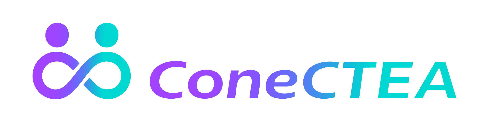

  
    
  <strong>Tecnologia, Acolhimento e Inclusão na Palma da Mão.</strong>
   
  <em>Desenvolvido com carinho para a rede de apoio <strong>Família TEA Bauru</strong>.</em>

  
  
  
  
  

---

| Área | Funcionalidade |
|---|---|
| 🌙 **Design** | Night Blue Premium System — Estética institucional e calma |
| 🪪 **Identificação** | Carteirinha Digital com QR Code seguro e validação em tempo real |
| 👨‍👩‍👧 **Dependentes** | Cadastro e gerenciamento de membros da família |
| 📋 **Solicitações** | Fluxo completo de solicitação e acompanhamento de carteirinhas |
| 🛡️ **Admin** | Painel administrativo com filtros, aprovações e gestão de documentos |
| 🔐 **Segurança** | RBAC multinível, RLS no banco, validação de CPF, LGPD compliant |
| 📱 **Scanner** | Leitura de QR Code interno para validação em eventos |

---

> [!IMPORTANT]
> **Aviso Legal:** O ConeCTEA é uma iniciativa da Família TEA Bauru para facilitar a identificação e acesso a serviços. Ele **não é a CIPTEA oficial** (Carteira de Identificação da Pessoa com Transtorno do Espectro Autista) e não substitui documentos de identificação emitidos por órgãos governamentais.

---

## 🛤️ Histórico de Versões

### 🌙 v3.3.0 — Night Blue Premium Design System *(atual)*
- **Identidade Visual**: Migração total para o Dark Mode "Azul Noite" como padrão institucional.
- **Background Premium**: Novo sistema de fundos com gradientes profundos e padrões geométricos sutis.
- **Bottom Navigation**: Barra de navegação premium expansível com animações em cápsula (pill-style).
- **Refinamento Global**: Padronização de cards glassmorphism, botões com gradientes e inputs de alto contraste.
- **Acessibilidade Neurodivergente**: Interface otimizada para pessoas autistas e TDAH (calma, organizada e previsível).
- **Avatar Unificado**: Novo componente de Avatar premium padronizado em todo o ecossistema.

### 💎 v3.2.0 — UX Refinement & Profile Governance
- **Home UI Refresh**: Card digital com animação de flutuação premium e foco na "Carteirinha Ativa".
- **Governança de Perfil**: Campos bloqueados por padrão com "Modo de Edição" protegido.
- **Segurança Crítica**: CPF e E-mail permanentemente bloqueados para edição direta.

---

## 🔮 Roadmap

- [x] 🌙 Design System Night Blue Premium
- [x] 🌍 Scanner de QR Code funcional
- [x] 🛡️ Hardening de Segurança (CPF, unicidade, RLS)
- [ ] 🎁 Módulo de Benefícios — catálogo de descontos e parcerias
- [ ] 🔔 Notificações Ativas — alertas de renovação de laudo
- [ ] 📄 Exportação PDF — via para impressão em alta definição

---

## 🛠️ Stack Tecnológica

| Camada | Tecnologia |
|---|---|
| **Front-end** | Flutter 3.41.9 (Dart 3.11.5) — Material 3 |
| **Navegação** | `go_router` — Rotas declarativas e tipadas |
| **Back-end** | Supabase (PostgreSQL, Auth, Storage, Realtime) |
| **UI Kit** | Phosphor Icons, Google Fonts (Outfit & Inter) |
| **Notificações** | OneSignal (Push Notifications mobile) |
| **Localização** | API IBGE — cidades e estados |

---

  Desenvolvido com 💙 para a <strong>Família TEA Bauru</strong>
   
  ConeCTEA v3.3.0 — 2026

