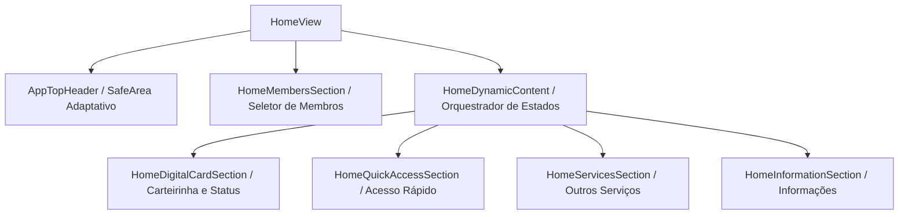

# Home Unificada — ConeCTEA

**App:** 0.5.0-dev  
**Documentação:** 4.2.0  
**Status:** Desenvolvimento
**Atualizado em:** 17/05/2026

---

## Objetivo

Descrever a arquitetura responsiva, a hierarquia de componentes e as blindagens visuais que estruturam a tela principal (**Home**) do ConeCTEA. Este documento consolida as decisões de engenharia de layout da Frente 26A para garantir conformidade em múltiplas densidades de tela e resoluções.

---

## 1. Arquitetura do Ecossistema da Home

A Home foi unificada para atuar como o centro operacional do usuário, com foco absoluto no **Documento Digital** (carteirinha do membro selecionado). O fluxo de informações e renderização obedece à seguinte estrutura:

### 1.1 HomeMembersSection (Seletor de Membros)
- **Local:** `lib/features/home/widgets/membros/home_members_section.dart`
- **Responsividade:** Remodelado na Frente 26A.3.2 para mitigar riscos de quebras de layout sob fontes grandes ou redimensionamento de exibição do sistema.
- **Diretriz Técnica:** Utiliza `BoxConstraints(minHeight: 64)` aliado a `MainAxisSize.min` e `shrinkWrap: true` na lista de avatares. Os itens usam `Flexible` ou `Padding` controlado, permitindo crescimento proporcional sob variações normais de escala da viewport vertical.

### 1.2 HomeDigitalCardSection (Documento Digital e Status)
- Concentra a exibição da carteirinha digital (`DigitalCardWidget`) e os botões de ação e alertas baseados no status do membro selecionado.
- Garante sincronização instantânea do status visual através de um mecanismo de `statusOverride` que evita latências de sincronização entre o banco local e o widget de exibição.

### 1.3 HomeQuickAccessSection (Acesso Rápido)
- **Local:** `lib/features/home/widgets/acesso_rapido/home_quick_access_section.dart`
- **Ajuste de Altura:** A altura do carrossel pai foi ajustada de `168` para `148` na Frente 26A.3.3. Isso removeu o vão vertical excessivo deixado pela compactação do `QuickAccessCard` (que removeu o `Spacer` interno e limitou sua altura máxima a `126px`), resultando em um visual coeso e harmonioso.

---

## 2. Blindagem e Responsividade Superior (SafeArea e Clearance)

Para lidar com a fragmentação de entalhes (notches), câmeras no topo (furos centrais, de canto ou duplos) e a status bar nativa do Android, a Home implementa um cálculo de clearance adaptativo:

- **Fórmula de Posicionamento:**
  - `topSafeArea = MediaQuery.of(context).padding.top`
  - `headerVisualHeight = 56.0` (altura fixa do logotipo/header)
  - `headerClearance = 8.0` (margem premium de espaçamento entre o Header e o Hero principal da Home)
- **Resultado Prático:** O Hero "Olá, Nome" e o conteúdo começam exatamente no ponto `topSafeArea + headerClearance`, otimizando o visual em relação à SafeArea antiga e fornecendo proteção visual contra cortes causados por entalhes superiores ou furos de câmera nos emuladores testados.

---

## 3. Proteção contra Overflow na Navbar Premium (PremiumBottomNavBar)

A transição entre abas gerava erros momentâneos de `RenderFlex` (Renderização Estourada) devido ao redimensionamento de largura dos itens ativos e inativos:

- **Diagnóstico:** O item ativo possui label textual (ex: "Carteirinha"), enquanto os itens inativos mostram apenas ícones. Durante os milissegundos de troca, a animação de interpolação reduzia a largura física do item para valores inferiores a `20px` antes de ocultar o texto, forçando a quebra de linha do texto e estourando o espaço disponível da `Row`.
- **Blindagem Aplicada:**
  - **Uso de Flexible:** O contêiner de texto ativo é envelopado em `Flexible(fit: FlexFit.loose)`.
  - **Uso de ClipRect:** Impede que os desenhos internos excedam os limites físicos do componente durante a transição.
  - **TextOverflow.ellipsis:** O texto diminui de forma suave até ser ocultado, mitigando tremores visuais e erros de layout sob as condições testadas na animação.
  - **Navegação de Sistema:** A navbar mantém suas proteções de bottom padding para convivência com os modos de navegação do SO (gestos e 3 botões tradicionais) sem sobreposição visual.

---

## 4. Auditoria de Segurança de Seções Adjacentes

Durante a subfase **26A.3.4-AUD**, as seções adjacentes de médio risco foram inspecionadas detalhadamente e consideradas seguras contra regressões visuais nos cenários de teste simulados:

### 4.1 Seção "Outros Serviços" (EmBreveServiceCard)
- **Local:** `lib/features/home/widgets/outros_servicos/em_breve_service_card.dart`
- **Características de Blindagem:**
  - Altura estática do card limitada a `170px` dentro de um carrossel pai de `185px`.
  - O buffer vertical de `15px` protege o desfoque de `BoxShadow` de `28` pixels (impedindo sombras cortadas).
  - O conteúdo textual consome apenas `128px`, restando `42px` dinâmicos protegidos por `Spacer` e `Flexible`.

### 4.2 Seção "Informações" (InfoActionCard)
- **Local:** `lib/features/home/widgets/informacoes/info_action_card.dart`
- **Características de Blindagem:**
  - Card dinâmico governado por paddings internos e dimensões do ícone (`42px`), totalizando `66px` em escala normal.
  - O carrossel pai reserva `80px` de altura, fornecendo `14px` de buffer seguro para sombras.
  - Proteção textual: subtítulos utilizam `maxLines: 1` e `overflow: TextOverflow.ellipsis`, mitigando expansão vertical indesejada sob variações de tamanho de fonte e mantendo a coerência estética.
