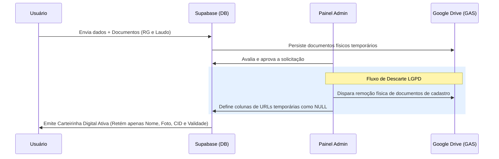

# Governança de Dados & LGPD — ConeCTEA

**App:** 0.7.0-dev
**Documentação:** 4.4.0
**Status:** Desenvolvimento
**Atualizado em:** 18/05/2026

---

## 1. Objetivo

Apresentar os pilares operacionais de governança de dados pessoais e privacidade no ecossistema ConeCTEA, em conformidade conceitual com a Lei Geral de Proteção de Dados Pessoais (LGPD - Lei nº 13.709/2018). Este documento detalha como a engenharia de software do projeto atua para mitigar a exposição, o tráfego e o armazenamento prolongado de Informações Pessoais Identificáveis (PII) e Dados Sensíveis.

---

## 2. Minimização e Classificação de Dados

O ConeCTEA coleta estritamente os dados necessários para validar o direito do dependente à carteirinha de identificação da pessoa com Transtorno do Espectro Autista (TEA).

### Classificação da Informação:
| Categoria do Dado | Exemplo de Campos | Sensibilidade | Base Legal Proposta |
| :--- | :--- | :--- | :--- |
| **Identificação Cadastral** | Nome Completo, CPF, Data de Nascimento. | Média | Execução de contrato ou procedimento preliminar. |
| **Contato Operacional** | Celular do Responsável, Telefone de Emergência. | Média | Execução de contrato ou proteção à vida (emergência). |
| **Dado Pessoal Sensível** | Código CID-10/CID-11, Documento de Laudo Médico. | Alta | Tutela da Saúde ou Consentimento explícito. |
| **Dado Biométrico/Identificador**| Foto do Perfil (para impressão na carteirinha). | Alta | Execução de contrato (identificação física visual). |

### Princípio da Minimização:
Seguindo o conceito de *privacy by design*, o aplicativo restringe a entrada de dados adicionais não essenciais. Campos textuais de diagnóstico são limitados à digitação do código internacional correspondente (CID).

---

## 3. Segurança no Fluxo de Revisão e Reenvio (Frente 26F)

A Frente 26F trouxe melhorias operacionais significativas voltadas à proteção de dados e à eliminação de resíduos de arquivos contendo informações pessoais na nuvem:

* **Solicitação de Exclusão Física Seletiva de Documentos Rejeitados:** Ao invés de manter cópias obsoletas de documentos pessoais (como fotos nítidas de RG/CPF ou laudos médicos antigos com históricos clínicos passados) no Google Drive institucional, o sistema aciona de forma síncrona/assíncrona a tentativa de delete físico destes arquivos através do Apps Script (GAS) após a confirmação administrativa de que o reenvio daquele item específico é necessário.
* **Isolamento de Acesso Reativo:** O formulário de reenvio do usuário final (`AddMemberPage`) bloqueia de forma robusta e visual a edição e a leitura de dados que já foram validados e considerados corretos. Isso mitiga a alteração acidental de informações cadastrais estáveis e reduz a exposição de dados sensíveis na tela durante o processo de saneamento de pendências.
* **Destravamento Dinâmico de CID:** O campo de texto correspondente ao CID e o seletor do Laudo Médico permanecem bloqueados de forma síncrona. O destravamento ocorre de forma exclusivamente reativa se — e somente se — o administrador tiver marcado especificamente o Laudo Médico como pendência de reenvio.

---

## 4. Política de Descarte de Resíduos Pós-Aprovação

Para atenuar a probabilidade de vazamento ou acesso não autorizado em repouso no longo prazo, o ecossistema ConeCTEA adota uma política de remoção/limpeza seletiva operacional de resíduos de auditoria após o encerramento da fase de análise:

1. **Aprovação e Emissão:** O administrador realiza a validação documental e aprova o cadastro do dependente.
2. **Expurgo Físico:** Uma vez gerada a carteirinha digital com sucesso e alterado o status do membro para Ativo, o sistema dispara a solicitação de limpeza automática dos arquivos originais de cadastro (Laudo Médico e Documento com Foto) armazenados no Google Drive.
3. **Limpeza Lógica:** As colunas correspondentes no banco de dados (`photo_document_url` e `medical_report_url`) são redefinidas para `null`, eliminando qualquer ponte de acesso aos arquivos obsoletos.
4. **Retenção Mínima:** Apenas os metadados finais e estritamente necessários para a renderização gráfica da carteirinha digital ativa (como o Nome, Foto de Perfil compactada, Código CID simplificado e Data de Validade) são preservados na tabela principal de membros do Supabase.

---

## 5. Mitigação Técnica de Riscos e Observabilidade

A equipe de engenharia do ConeCTEA adota uma postura transparente e realista em relação à segurança dos sistemas cibernéticos:

* **Tolerância a Falhas de Rede:** Se a comunicação com a API do Google Drive via GAS falhar no momento de apagar fisicamente um documento sensível rejeitado, a transição lógica no banco Supabase não é impedida de prosseguir. A prioridade do sistema é manter o fluxo de controle seguro na base do aplicativo.
* **Auditoria de Pendências de Limpeza:** O erro do GAS é lançado silenciosamente e catalogado em log no terminal administrativo. Isso viabiliza que as equipes técnicas realizem varreduras periódicas na pasta do Google Drive para expurgar de forma manual eventuais arquivos remanescentes que não foram excluídos automaticamente devido a falhas na infraestrutura de rede externa do Google.
* **Segurança na Bancada:** A arquitetura do ConeCTEA encontra-se em constante fase de desenvolvimento técnico e testes de laboratório. As estratégias de privacidade de dados descritas neste guia visam mitigar riscos cibernéticos sistêmicos, sem promessas de segurança absoluta ou invulnerabilidade cibernética, priorizando sempre as boas práticas de engenharia de software e a mitigação ativa de riscos.

---

## 6. Privacidade por Padrão no Fluxo de Abandono e Descarte (Frente 26G)

A Frente 26G fortaleceu as premissas de *privacy by design* e *privacy by default* ao estruturar a jornada do botão `"Fazer mais tarde"` e o descarte seguro de alterações na `AddMemberPage`:

* **Decisão Arquitetural contra a Persistência de Rascunhos:** Visando atenuar a exposição de Informações Pessoais Identificáveis (PII) e dados de saúde de menores em trânsito e em repouso, o ConeCTEA adotou a premissa técnica de **não persistir dados provisórios** (rascunhos) localmente em banco embarcado ou na nuvem Supabase enquanto o cadastro do membro não estiver devidamente revisado e submetido voluntariamente pelas famílias. Isto apoia diretamente o princípio da minimização de dados e a transparência operacional, evitando que dados incompletos ou abandonados fiquem armazenados na infraestrutura do sistema.
* **Higiene e Expurgo Físico na Sessão Ativa:** Para impedir a proliferação de documentos sensíveis remanescentes na nuvem institucional (Google Drive) quando uma família inicia um fluxo de envio de imagem e decide abandonar a tela no meio do processo, o aplicativo rastreia as URLs provisórias e aciona silenciosamente em segundo plano a tentativa de exclusão física seletiva dessas mídias via Apps Script (GAS) ao confirmar a ação `"Sair sem Salvar"`.
* **Risco Residual Coerente:** Em conformidade com a natureza distribuída das redes de telefonia celular, há o risco residual conhecido de falha na entrega destas requisições de expurgo físico caso ocorra perda súbita de conexão de rede antes do fechamento do app. Para mitigar esse cenário, a integridade operacional e a limpeza lógica no banco de dados do Supabase permanecem inalteradas, e os arquivos residuais na nuvem podem ser monitorados e higienizados de forma transparente e independente na lixeira ou pasta do Drive, mantendo a conformidade prática sob observação operacional periódica, sem a necessidade de ações adicionais ou intervenções no celular da família.

---

## 7. Integridade e Consistência Temporal (Frente 26H)

Sob as premissas de integridade dos dados e segurança da informação, a Frente 26H introduziu regras rígidas para o controle de datas e prazos baseados no servidor:

* **Prevenção contra Adulterações Locais:** O rastreamento de prazos e validades baseia-se exclusivamente no fuso oficial do projeto (`America/Sao_Paulo` UTC-3), processado e calculado no banco de dados. Isso impede a manipulação de tempos locais por usuários que poderiam tentar adiar prazos de revisão ou prolongar de forma ilegal a validade civil de suas carteirinhas alterando as configurações de relógio do celular.
* **Segurança e Rastreabilidade:** Triggers automáticos no banco gerenciam a transição lógica dos status e datas limitadoras, fornecendo trilhas cronológicas idôneas para auditorias técnicas, mantendo o ecossistema robusto e em conformidade conceitual com os princípios de segurança, integridade de dados e responsabilidade da LGPD.

---

## 8. Transparência no App (Evolução Central do Usuário)

Como pilar de conformidade prática e boa-fé com a LGPD, o aplicativo ConeCTEA disponibiliza a área de **Privacidade e dados** na Central do Usuário, atuando ativamente na educação e informação das famílias.

### Interfaces Dedicadas à Transparência:
*   **Dados Armazenados (`StoredDataView`):** Detalha de forma didática todas as classes de dados retidos pela Família TEA Bauru, ajudando a esclarecer as dúvidas e diminuir a apreensão das famílias sobre quais informações estão sob a custódia do app.
*   **Uso das Informações (`InformationUsageView`):** Explicita de forma clara as finalidades específicas de cada dado cadastral e sensível coletado no app.
*   **Consentimentos e Autorizações (`ConsentsView`):** Interface que categoriza os tratamentos de dados.
    *   *Nota de Limitação:* Os switches de consentimento funcionam atualmente de forma visual e local, sem persistência no banco remoto Supabase nesta versão.
*   **Telas Legais Internas (`TermsOfUseView` e `PrivacyPolicyView`):** Oferecem acesso contínuo e irrestrito aos textos completos dos Termos de Uso e Política de Privacidade do app. O fechamento das telas (botão "Entendi") serve para controle de navegação e não configura aceite vinculante no banco, cuja ação é gerida no cadastro/login.
*   **Modal de Informações do ConeCTEA:** Nova estrutura institucional de transparência que exibe detalhes técnicos do app, ambiente de compilação e a seção **Tecnologias de apoio** (Supabase, Google Drive/GAS, OneSignal, etc.), informando claramente como a infraestrutura técnica está distribuída.

### Princípios de Comunicação Legal e Limitações:
1.  **Não Comercialização:** O app comunica explicitamente que **não vende, aluga ou compartilha dados pessoais** das famílias com empresas ou instituições externas para fins comerciais.
2.  **Cuidado Especial com Dados Sensíveis:** Documentos comprovatórios (identificações e laudos) são evidenciados como dados de alta sensibilidade, cujo tratamento segue regras restritas de visualização administrativa e exclusão programada pós-aprovação.
3.  **Finalidade Comunitária:** Os termos jurídicos e a interface reiteram ativamente que a Carteirinha ConeCTEA é de natureza puramente interna/comunitária, não substituindo o documento oficial CIPTEA (carteirinha oficial do governo) ou documentos de identificação civil (RG, CPF).
4.  **Limites Clínicos:** O aplicativo reforça enfaticamente que **não realiza triagem médica, diagnóstico, tratamento** ou qualquer intervenção clínica, não substituindo consultas e avaliações profissionais de saúde.
