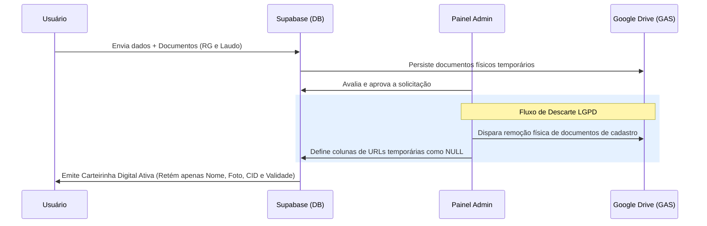

# Governança de Dados & LGPD — ConeCTEA

**App:** 0.6.0-dev
**Documentação:** 4.3.0
**Status:** Desenvolvimento
**Atualizado em:** 17/05/2026

---

## 1. Objetivo

Apresentar os pilares operacionais de governança de dados pessoais e privacidade no ecossistema ConeCTEA, em conformidade conceitual com a Lei Geral de Proteção de Dados Pessoais (LGPD - Lei nº 13.709/2018). Este documento detalha como a engenharia de software do projeto atua para mitigar a exposição, o tráfego e o armazenamento prolongado de Informações Pessoais Identificáveis (PII) e Dados Sensíveis.

---

## 2. Minimização e Classificação de Dados

O ConeCTEA coleta estritamente os dados necessários para validar o direito do dependente à carteirinha de identificação da pessoa com Transtorno do Espectro Autista (TEA).

### Classificação da Informação:
| Categoria do Dado | Exemplo de Campos | Sensibilidade | Base Legal Proposta |
| :--- | :--- | :--- | :--- |
| **Identificação Cadastral** | Nome Completo, CPF, Data de Nascimento. | Média | Execução de contrato ou procedimento preliminar. |
| **Contato Operacional** | Celular do Responsável, Telefone de Emergência. | Média | Execução de contrato ou proteção à vida (emergência). |
| **Dado Pessoal Sensível** | Código CID-10/CID-11, Documento de Laudo Médico. | Alta | Tutela da Saúde ou Consentimento explícito. |
| **Dado Biométrico/Identificador**| Foto do Perfil (para impressão na carteirinha). | Alta | Execução de contrato (identificação física visual). |

### Princípio da Minimização:
Seguindo o conceito de *privacy by design*, o aplicativo restringe a entrada de dados adicionais não essenciais. Campos textuais de diagnóstico são limitados à digitação do código internacional correspondente (CID).

---

## 3. Segurança no Fluxo de Revisão e Reenvio (Frente 26F)

A Frente 26F trouxe melhorias operacionais significativas voltadas à proteção de dados e à eliminação de resíduos de arquivos contendo informações pessoais na nuvem:

* **Solicitação de Exclusão Física Seletiva de Documentos Rejeitados:** Ao invés de manter cópias obsoletas de documentos pessoais (como fotos nítidas de RG/CPF ou laudos médicos antigos com históricos clínicos passados) no Google Drive institucional, o sistema aciona de forma síncrona/assíncrona a tentativa de delete físico destes arquivos através do Apps Script (GAS) após a confirmação administrativa de que o reenvio daquele item específico é necessário.
* **Isolamento de Acesso Reativo:** O formulário de reenvio do usuário final (`AddMemberPage`) bloqueia de forma robusta e visual a edição e a leitura de dados que já foram validados e considerados corretos. Isso mitiga a alteração acidental de informações cadastrais estáveis e reduz a exposição de dados sensíveis na tela durante o processo de saneamento de pendências.
* **Destravamento Dinâmico de CID:** O campo de texto correspondente ao CID e o seletor do Laudo Médico permanecem bloqueados de forma síncrona. O destravamento ocorre de forma exclusivamente reativa se — e somente se — o administrador tiver marcado especificamente o Laudo Médico como pendência de reenvio.

---

## 4. Política de Descarte de Resíduos Pós-Aprovação

Para atenuar a probabilidade de vazamento ou acesso não autorizado em repouso no longo prazo, o ecossistema ConeCTEA adota uma política de remoção/limpeza seletiva operacional de resíduos de auditoria após o encerramento da fase de análise:

1. **Aprovação e Emissão:** O administrador realiza a validação documental e aprova o cadastro do dependente.
2. **Expurgo Físico:** Uma vez gerada a carteirinha digital com sucesso e alterado o status do membro para Ativo, o sistema dispara a solicitação de limpeza automática dos arquivos originais de cadastro (Laudo Médico e Documento com Foto) armazenados no Google Drive.
3. **Limpeza Lógica:** As colunas correspondentes no banco de dados (`photo_document_url` e `medical_report_url`) são redefinidas para `null`, eliminando qualquer ponte de acesso aos arquivos obsoletos.
4. **Retenção Mínima:** Apenas os metadados finais e estritamente necessários para a renderização gráfica da carteirinha digital ativa (como o Nome, Foto de Perfil compactada, Código CID simplificado e Data de Validade) são preservados na tabela principal de membros do Supabase.

---

## 5. Mitigação Técnica de Riscos e Observabilidade

A equipe de engenharia do ConeCTEA adota uma postura transparente e realista em relação à segurança dos sistemas cibernéticos:

* **Tolerância a Falhas de Rede:** Se a comunicação com a API do Google Drive via GAS falhar no momento de apagar fisicamente um documento sensível rejeitado, a transição lógica no banco Supabase não é impedida de prosseguir. A prioridade do sistema é manter o fluxo de controle seguro na base do aplicativo.
* **Auditoria de Pendências de Limpeza:** O erro do GAS é lançado silenciosamente e catalogado em log no terminal administrativo. Isso viabiliza que as equipes técnicas realizem varreduras periódicas na pasta do Google Drive para expurgar de forma manual eventuais arquivos remanescentes que não foram excluídos automaticamente devido a falhas na infraestrutura de rede externa do Google.
* **Segurança na Bancada:** A arquitetura do ConeCTEA encontra-se em constante fase de desenvolvimento técnico e testes de laboratório. As estratégias de privacidade de dados descritas neste guia visam mitigar riscos cibernéticos sistêmicos, sem promessas de segurança absoluta ou invulnerabilidade cibernética, priorizando sempre as boas práticas de engenharia de software e a mitigação ativa de riscos.
