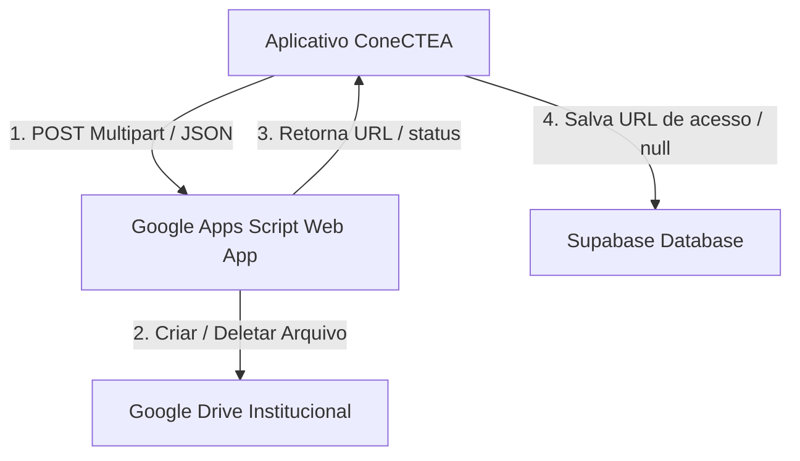

# Google Drive & GAS — ConeCTEA

**App:** 0.6.0-dev
**Documentação:** 4.3.0
**Status:** Desenvolvimento
**Atualizado em:** 17/05/2026

---

## 1. Objetivo

Mapear a arquitetura de integração técnica do aplicativo ConeCTEA com o Google Drive e o Google Apps Script (GAS) para armazenamento persistente de documentos sensíveis anexados (Documento com Foto/RG e Laudo Médico), detalhando os fluxos operacionais de upload, solicitação de deleção física e resiliência de dados na nuvem.

---

## 2. Arquitetura da Integração

Por diretrizes de segurança da informação e para evitar a exposição direta de chaves de API restritas ou credenciais de serviço do Google Cloud Platform (GCP) no código-fonte cliente (aplicativo móvel), o ConeCTEA utiliza uma ponte intermediária baseada em **Google Apps Script (GAS)**, publicada como um aplicativo Web executável (`Web App`).



### Componentes Principais:
1. **Web App GAS:** Um script hospedado no ambiente institucional do Google Workspace que atua como uma API Gateway restrita.
2. **Google Drive:** Repositório físico onde os arquivos são catalogados em pastas organizadas por nome e ID do membro.
3. **Database Service (`database_service.dart`):** Camada de serviço no Flutter encarregada de gerenciar a lógica de transação local, persistência lógica no Supabase e acionamento assíncrono dos endpoints do GAS.

---

## 3. Fluxo de Upload de Arquivos

O fluxo de envio de documentos durante a submissão de uma nova solicitação de carteirinha ocorre em etapas bem definidas:

1. **Seleção de Mídia:** O usuário escolhe um documento local (PDF ou imagem) por meio do utilitário `FilePicker` de forma multiplataforma.
2. **Geração de Payload:** Os bytes do arquivo e a extensão correspondente são lidos e encapsulados em uma requisição multipart HTTP POST direcionada à URL de deploy do GAS.
3. **Processamento no Google Apps Script:**
   - O script recebe o payload e valida o token de autenticação embutido.
   - Localiza ou cria a pasta do dependente baseando-se nas informações cadastrais.
   - Grava fisicamente os bytes do arquivo e define as regras de compartilhamento para que o arquivo possa ser consultado pelos administradores credenciados.
   - Retorna um JSON de sucesso contendo o `fileId` gerado pelo Google Drive e a URL pública para visualização do documento.
4. **Persistência de Referência:** O aplicativo ConeCTEA recebe a resposta e salva a URL retornada nos campos específicos (`photo_document_url` ou `medical_report_url`) da tabela `card_requests` (ou na tabela `members` caso o registro já esteja aprovado).

---

## 4. Fluxo de Solicitação de Exclusão Física Seletiva (Frente 26F)

A Frente 26F mitigou o risco de inconsistência de links e arquivos obsoletos. O trigger de solicitação de deleção de arquivos rejeitados no Drive foi removido do fluxo de preenchimento provisório do usuário e transferido para a camada administrativa, atuando em harmonia com a atualização lógica no Supabase.

### Como Funciona a Exclusão Seletiva:
No momento em que o administrador avalia a carteirinha e identifica inconformidades nos documentos anexados, ele aciona o pedido de correção/reenvio na interface administrativa. O sistema então dispara a solicitação das seguintes etapas no banco de dados e na nuvem:

```
                  ┌──────────────────────────────┐
                  │   Administrador envia para   │
                  │     correção no Painel       │
                  └──────────────┬───────────────┘
                                 │
                 [Analisa itens pendentes]
                                 │
             ┌───────────────────┴───────────────────┐
             ▼                                       ▼
     [RG com Pendência?]                     [Laudo com Pendência?]
             │                                       │
     ┌───────┴───────┐                       ┌───────┴───────┐
     │ Sim           │ Não                   │ Sim           │ Não
     ▼               ▼                       ▼               ▼
[Extrai fileId RG]  [Mantém intacto]     [Extrai fileId Laudo][Mantém intacto]
     │                                       │
[Chama GAS p/    ]                       [Chama GAS p/      ]
[deletar físico  ]                       [deletar físico    ]
     │                                       │
[Limpa no Supa   ]                       [Limpa no Supa     ]
[photo_doc = null]                       [med_report = null ]
```

1. **Identificação do Arquivo a Deletar:** O serviço examina a URL armazenada no Supabase. Através de regex ou parsing de query params, extrai o identificador exclusivo (`fileId`) do arquivo hospedado no Google Drive.
2. **Solicitação de Deleção Física Seletiva:**
   - Se apenas o **Documento com Foto (RG)** foi marcado para reenvio: O aplicativo executa uma chamada HTTP POST direcionada ao GAS solicitando o delete físico daquele ID específico. A coluna `photo_document_url` é atualizada para `null` no Supabase. O Laudo Médico e sua respectiva URL são **preservados intactos**.
   - Se apenas o **Laudo Médico** foi marcado para reenvio: Repete-se o fluxo de delete físico estritamente para o ID do laudo, e a coluna `medical_report_url` é definida como `null` no banco de dados. O Documento com Foto permanece funcional e seguro.
   - Se ambos forem marcados: Ambos os deletes físicos são disparados individualmente e as duas colunas são limpas no banco de dados.
3. **Conclusão:** O usuário final, ao abrir o seu aplicativo e clicar em "CORRIGIR", verá apenas os campos e arquivos específicos que foram limpos pelo administrador disponíveis para novo upload, contendo a sinalização clara de obrigatoriedade.

---

## 5. Tratamento de Erros e Resiliência Operacional

As comunicações externas com APIs de terceiros estão sujeitas a falhas intermitentes. O ConeCTEA implementa uma arquitetura tolerante a falhas no gerenciamento de arquivos na nuvem:

* **Resiliência a Falhas no Drive/GAS:** Caso o endpoint de solicitação de exclusão do GAS falhe (por exemplo, devido a instabilidade de rede, timeout, ou alteração abrupta de permissões de pastas), **a transação de limpeza lógica no Supabase NÃO é abortada**.
* **Priorização da Experiência do Usuário:** O status do pedido muda normalmente para "Revisar" e o banco de dados é atualizado para `null`. O erro do Drive/GAS é capturado silenciosamente e reportado no terminal de logs administrativos do sistema para fins de auditoria interna. Isso evita que o fluxo do usuário ou do administrador trave devido a um problema colateral da API externa do Google.
* **Mitigação de Perda Acidental:** Ao remover a lógica de exclusão física do método `_pickAndUploadFile` no lado do usuário móvel, mitigamos significativamente o risco de exclusão de arquivos no Drive caso o usuário escolha um arquivo local por engano e depois desista da operação fechando o aplicativo. A remoção física de dados obsoletos ocorre apenas quando há uma decisão administrativa explícita e de tratamento planejado de reenvio.
